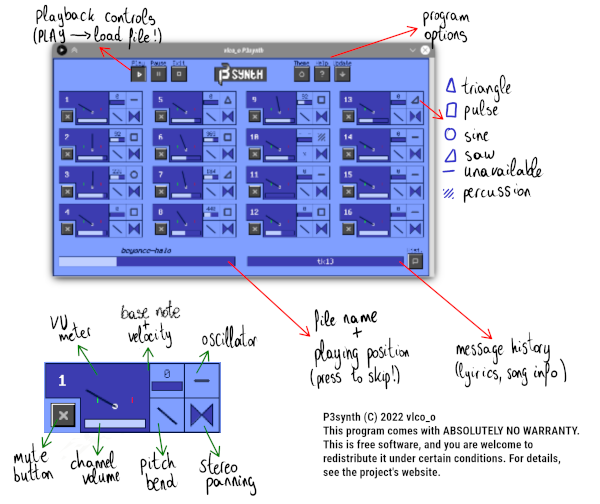

---

A synthesizer and MIDI visualization program programmed on Processing 3.
Supports playback of MID files.

### Quick start
Get the latest (top most) executable (Windows or Linux) from the [releases](https://github.com/vlcoo/P3synth/releases) page. You will need the latest version of Java 8 (if needed, go [here](https://java.com/en/download/)).

Upon opening, simply press "Play" to begin!

### Source code
If downloading from source, the following libraries are needed. Keep in mind this is Processing 3 code, not plain old Java.
- UIBooster
- Javax MIDI
